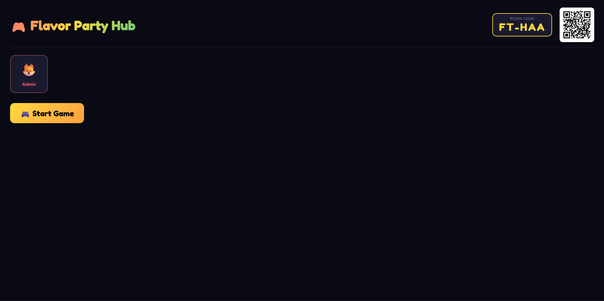
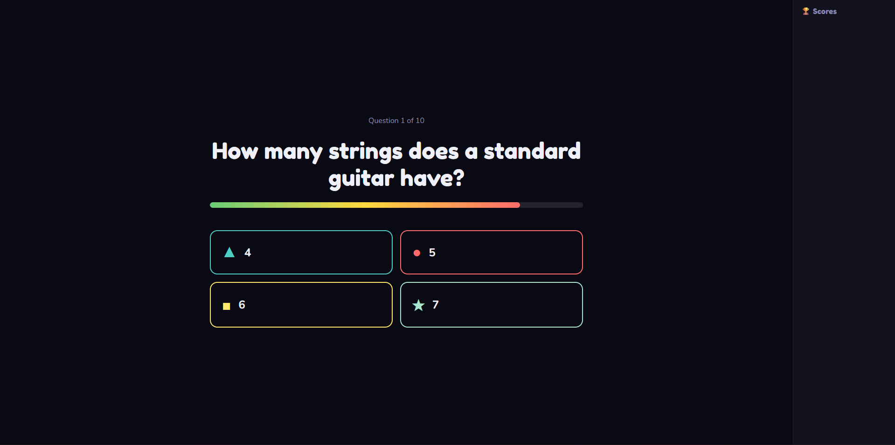
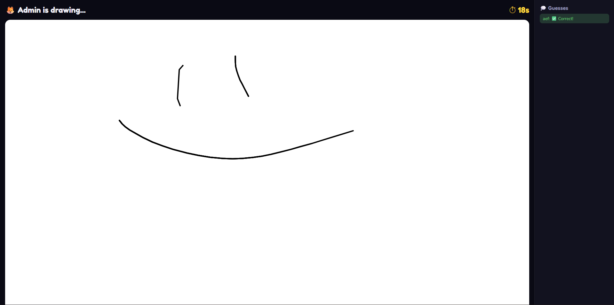
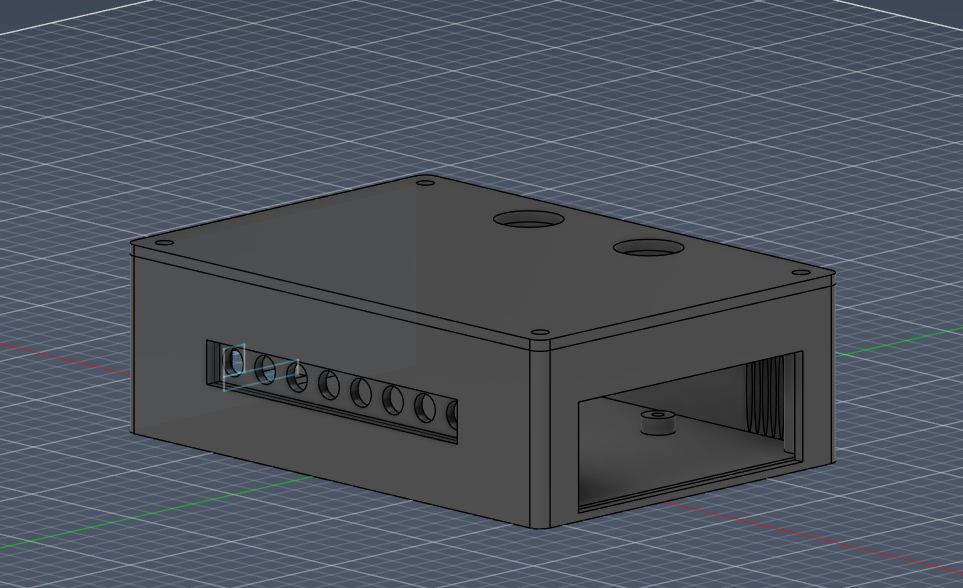
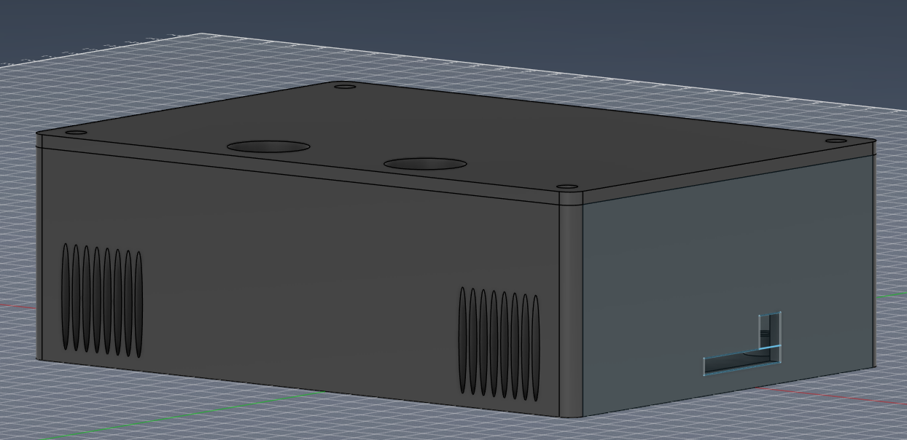

🎮 Flavor Party Hub

Flavor Party Hub is a DIY party game console where the TV is the screen and players' phones are the controllers, no app install needed, everything runs in the browser.



🕹️ How It Works

When the TV opens the app, the server automatically creates a room with a unique code and QR Code. Players scan the QR Code or type the code in their phone's browser to join. The first player to join becomes the Host and controls the game from the TV.

All communication between the TV and phones happens through a Node.js + Socket.io server using WebSockets — this is what makes everything update in real time.

🎯 Mini-Games

🧠 The Brainiac (Quiz)
The Brainiac is a speed quiz where the question appears on the TV with 4 colored options. Players answer using symbol buttons on their phones without seeing the text forcing them to look at the TV. Points are calculated based on speed and correctness.



⚡ Nitro Click (Reaction Test)
The screen turns red u need to wait for green, then click as fast as possible. Click before the green appears and you're eliminated for that round.


🎨 Doodle Dash (Drawing)
One player gets a secret word and draws it on their phone. The drawing appears in real time on the TV while other players type their guesses.(similar to gartic)



🏗️ Architecture
```
flavor-party-hub/
├── server/
│   ├── index.js          ← Express + Socket.io server
│   ├── roomManager.js    ← Room and player management
│   └── gameLogic.js      ← Game rules for all 3 mini-games
├── tv-client/
│   └── index.html        ← TV interface
└── mobile-client/
    └── index.html        ← Phone controller interface
```

🔧 Hardware

This software is designed to run on a **Raspberry Pi 5** connected to a TV via HDMI. The Raspberry Pi sits inside a custom 3D printed case and connects to a custom PCB featuring:




- 8 LEDs for visual effects
- 1 buzzer for sound feedback  
- 2 push buttons
- Custom JST connectors

The PCB was designed in KiCad and connects directly to the Raspberry Pi via the 40-pin GPIO header.

🚀 Setup
```bash
cd server
npm install
npm start
```

Then open `http://localhost:3000/tv` on the TV and `http://[LOCAL_IP]:3000/mobile` on phones.

📦 Dependencies

- Node.js
- Express
- Socket.io
- QRCode
